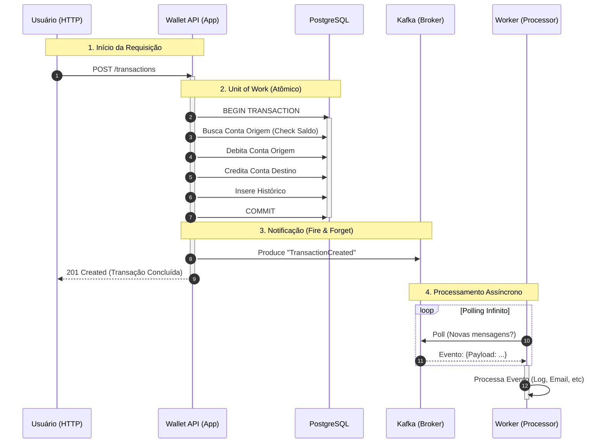
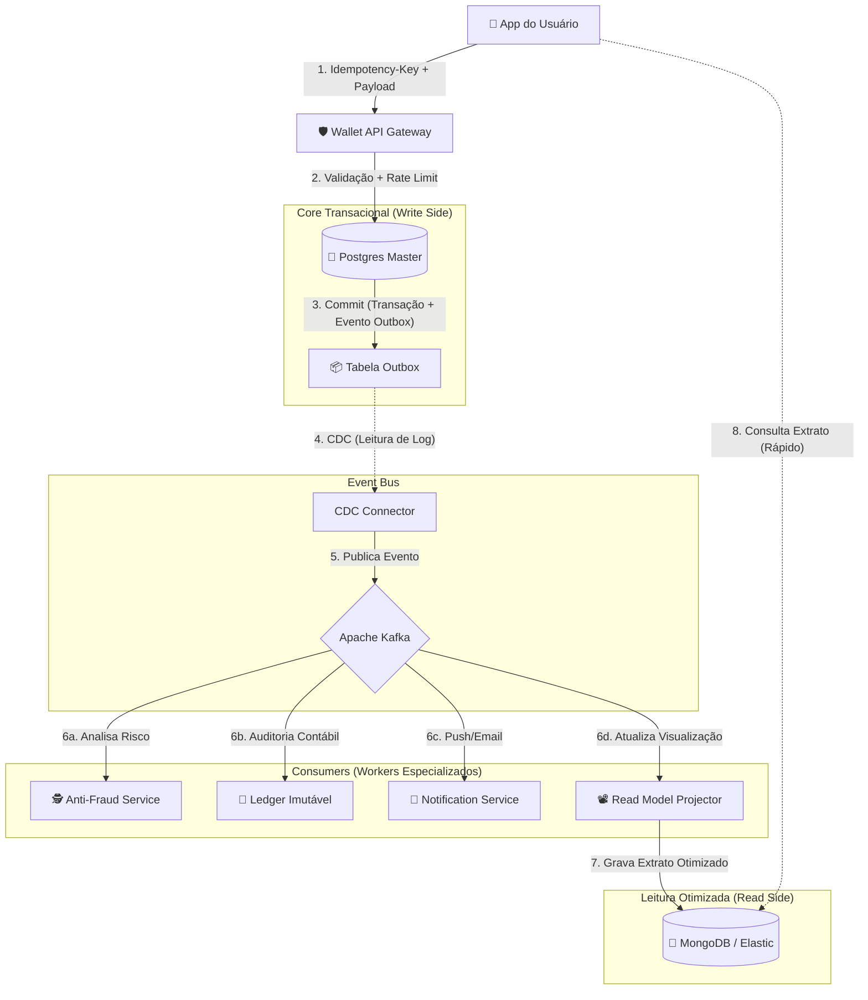

# Wallet Core (EDA Study)

Este projeto é uma implementação de um núcleo de transações financeiras (Wallet Core) baseada em Arquitetura Orientada a Eventos (EDA).

Foi desenvolvido como parte do desafio do curso Full Cycle, mas utilizando uma stack moderna e funcional com **Clojure** e **Polylith**, focando em imutabilidade, modularidade e separation of concerns.

## 🏗 Arquitetura & Stack

O projeto segue uma estrutura de Monorepo modular gerenciada pelo **Polylith**:

* **Linguagem:** Clojure (JDK 17+)
* **Gerenciamento de Workspace:** Polylith (`poly`)
* **Validação de Dados:** Malli
* **Banco de Dados:** PostgreSQL 15 (via `next.jdbc` e `HoneySQL`)
* **Mensageria:** Apache Kafka (via `Jackdaw`)
* **API:** Jetty + Reitit + Ring

### Estrutura do Workspace

```text
bases/
  └── wallet-api/       # API Gateway (REST -> Componentes)
  └── event-processor/  # Worker (Processamento Assíncrono)
components/
  ├── account/          # Domínio de Contas e Saldo
  ├── client/           # Domínio de Clientes
  ├── transaction/      # Core: Atomicidade e Orquestração
  ├── database/         # Infra: Connection Pool e Migrations
  └── kafka/            # Infra: Producers
projects/
  └── wallet/           # Artefato Deployável (Uberjar)

```

## 🚀 Como Rodar

### Pré-requisitos

* Docker & Docker Compose
* Clojure CLI
* Ferramenta `poly` (opcional, mas recomendada)

### 1. Subir Infraestrutura

Inicie o PostgreSQL, Zookeeper e Kafka:

```bash
docker compose up -d

```

### 2. Rodar a Aplicação (Modo Dev)

Você pode rodar diretamente via Clojure CLI a partir do projeto `wallet`:

```bash
cd projects/wallet
clojure -M -m br.com.eda.wallet-api.core

```

Ou, se preferir rodar tudo via Docker (Build Final):

```bash
docker compose up --build app

```

A API estará disponível em: `http://localhost:8080`

## 🧪 Testando a API

Para facilitar os testes, você pode usar o arquivo `requests.http` (requer extensão **REST Client**) ou utilizar os comandos `curl` abaixo.

### 1. Health Check
Verifica se a API está online.
```bash
curl -X GET http://localhost:8080/health
```

### 2. Clientes
#### Criar Cliente
```bash
curl -X POST http://localhost:8080/clients \
  -H "Content-Type: application/json" \
  -d '{"name": "Neo", "email": "neo@matrix.com"}'
```

#### Listar Clientes
```bash
curl -X GET http://localhost:8080/clients
```

### 3. Contas
#### Criar Conta
Use o `id` retornado na criação do cliente.
```bash
curl -X POST http://localhost:8080/accounts \
  -H "Content-Type: application/json" \
  -d '{"client_id": "UUID_DO_CLIENTE"}'
```

#### Listar Contas
```bash
curl -X GET http://localhost:8080/accounts
```

#### Ver Saldo
```bash
curl -X GET http://localhost:8080/accounts/UUID_DA_CONTA/balance
```

### 4. Transações
#### Realizar Transferência
Isso debita da origem, credita no destino (Atomicamente) e publica no Kafka.
```bash
curl -X POST http://localhost:8080/transactions \
  -H "Content-Type: application/json" \
  -d '{
    "account_id_from": "UUID_CONTA_ORIGEM",
    "account_id_to": "UUID_CONTA_DESTINO",
    "amount": 100
  }'
```

#### Ver Extrato (Histórico)
```bash
curl -X GET http://localhost:8080/accounts/UUID_DA_CONTA/transactions
```

## 🛠 Desenvolvimento

Para rodar os testes de todos os componentes:

```bash
clojure -M:poly test

```

Para verificar a integridade do workspace:

```bash
clojure -M:poly check

```

---

## ⚠️ Trade-offs e Melhorias Futuras

### Consistência de Dados (The Dual Write Problem)
A implementação atual do componente `Transaction` utiliza uma abordagem pragmática para o escopo deste exercício:
1. Commit da transação no PostgreSQL (Atomicidade garantida via `jdbc/with-transaction`).
2. Publicação do evento no Kafka (Fire and forget).

**Cenário de Risco:**
Existe uma janela de falha teórica (milissegundos) entre o commit do banco e a publicação no Kafka. Se o processo da aplicação for encerrado abruptamente (Crash/OOM/Falha de Rede) exatamente neste intervalo, o sistema entrará em estado inconsistente (Dinheiro debitado, mas evento não emitido).

**Solução para Produção:**
Para evoluir este projeto para um ambiente crítico, a solução recomendada seria implementar o **Transactional Outbox Pattern**:
1. Persistir o evento em uma tabela `outbox` dentro da mesma transação SQL da transferência.
2. Utilizar um processo assíncrono (Relay ou CDC com Debezium) para ler a tabela `outbox` e publicar no Kafka com garantia de entrega *At-Least-Once*.

### Outras Melhorias
* **Idempotência no Consumo:** Garantir que os consumidores Kafka lidem com mensagens duplicadas.
* **Schema Registry:** Adotar Avro ou JSON Schema para contrato estrito de mensagens.
* **Distributed Tracing:** Implementar OpenTelemetry para rastrear o fluxo entre API -> DB -> Kafka.

---

### 📊 O Fluxo de Sequência (Passo a Passo)

Este diagrama mostra exatamente o que acontece desde o momento em que o usuário chama a API até o Worker processar o evento.



---

### 📝 Detalhando as Etapas

Aqui está o que acontece em cada fase numerada no diagrama:

#### 1. A Solicitação (Síncrono)

O cliente (pode ser um App Mobile, Frontend ou Postman) envia o JSON pedindo a transferência.

* **Responsável:** `bases/wallet-api` (Handlers).
* **Validação:** O `Malli` verifica se os IDs são strings e se o valor é positivo.

#### 2. O Coração do Sistema (ACID)

É aqui que a mágica acontece. Usamos `jdbc/with-transaction` para garantir a integridade financeira.

* **Onde:** `components/transaction`.
* **Ação:** O dinheiro sai de A e vai para B matematicamente.
* **Garantia:** Se a luz acabar na linha do "Débito", o "Crédito" nunca acontece e o banco faz *Rollback* automático. **O dinheiro está seguro.**

#### 3. A Promessa (Eventual Consistency)

Imediatamente após o banco confirmar "OK, gravei", a API avisa o Kafka.

* **Ação:** Publicamos no tópico `transactions`.
* **Performance:** Note que a API responde `201 Created` para o usuário **antes** do Worker fazer qualquer coisa. Isso faz a API ser extremamente rápida (milissegundos), pois ela não espera o processamento pesado.

#### 4. O Trabalho Pesado (Assíncrono)

Em um universo paralelo (outro processo, outro container), o Worker acorda.

* **Onde:** `bases/event-processor`.
* **Ação:** Ele vê que chegou uma mensagem.
* **Efeito:** No nosso caso, ele imprime os logs. No mundo real, ele enviaria e-mails, notificaria o banco central, atualizaria relatórios de BI, etc.

### Por que separamos assim?

Se o passo **4 (Worker)** falhar (ex: serviço de e-mail fora do ar), a transação **não é cancelada**. O dinheiro já foi transferido no passo **2**. O Worker apenas tenta processar o evento novamente mais tarde. Isso torna o sistema muito mais resiliente a falhas externas.

---

Para transformar o nosso projeto acadêmico `eda-study` em uma arquitetura de **Fintech Real ("Battle-Tested")**, precisamos endereçar problemas que só aparecem em escala e com dinheiro de verdade em jogo: **Fraude, Consistência Eventual, Latência e Escalabilidade de Leitura.**

Aqui está a ilustração de como esse sistema evoluiria na vida real.

### 🏛 A Arquitetura Fintech Realista (CQRS + Event Sourcing + Sagas)

Neste cenário, o fluxo não é apenas "Mover dinheiro e Logar". O evento `TransactionCreated` dispara uma reação em cadeia em vários departamentos (Microsserviços).

#### 1. O Diagrama de Fluxo "Battle-Tested"



---

### 🧠 Deep Dive: Questões de Engenharia e Arquitetura

Vamos detalhar as camadas adicionadas e por que elas são obrigatórias numa Fintech real.

#### 1. A Entrada: Idempotência e Rate Limiting

No nosso código, se o usuário clicar 2 vezes no botão "Transferir", o dinheiro sai 2 vezes.

* **Realidade:** O App envia um Header `Idempotency-Key` (um UUID gerado no celular).
* **Engenharia:** A API verifica no Redis se essa chave já foi processada. Se sim, retorna o resultado anterior cacheado, sem tocar no Postgres. Isso evita **Double Spending** em redes instáveis.

#### 2. O Core: Transactional Outbox (CDC)

Como discutimos, o código atual tem o risco de escrever no banco e falhar no Kafka.

* **Realidade:** Usamos **CDC (Change Data Capture)**. Ferramentas como **Debezium** leem o log binário do Postgres (WAL) e garantem que *cada linha inserida no banco vire um evento no Kafka*.
* **Benefício:** Zero perda de dados. O banco é a fonte da verdade, o Kafka é o reflexo fiel.

#### 3. O Cérebro: Fraude e Sagas (Compensating Transactions)

E se a transferência for aprovada pelo banco, mas o Worker de Fraude (`Fraud`) detectar que é uma lavagem de dinheiro 1 segundo depois? O dinheiro já saiu!

* **Arquitetura:** Padrão **Saga (Coreografia)**.
* **Fluxo:**
1. Core: Move dinheiro (Status: `PENDING`).
2. Kafka: Publica `TransactionPending`.
3. Fraud Worker: Analisa. Se detectar fraude, publica evento `FraudDetected`.
4. Core (Consumer): Escuta `FraudDetected` e executa uma **Transação de Compensação** (Estorno/Refund) e marca como `REJECTED`.


#### 4. A Visão: CQRS (Command Query Responsibility Segregation)

No nosso código, usamos `h/select` na mesma tabela `transactions` que recebe escritas.

* **O Problema:** Num dia de pagamento (dia 5), milhões de pessoas abrem o app para ver o saldo (Leitura), travando o banco para quem quer transferir (Escrita).
* **Realidade:** Separamos leitura e escrita.
* **Write Side (Postgres):** Normalizado, rígido, focado em integridade.
* **Read Side (NoSQL/Elastic):** O Worker `Projector` pega o evento e monta um JSON pronto para a tela do celular ("Extrato Bonito").


* **Engenharia:** O App consulta o NoSQL. É absurdamente rápido e barato, e nunca trava as transações.

#### 5. O Livro Razão: Ledger Imutável

A tabela `transactions` do nosso projeto é mutável. Numa fintech, contadores precisam de um histórico que prova que o saldo de A + B é igual ao total de dinheiro no banco.

* **Realidade:** O Worker `Ledger` grava num banco específico (como **Datomic** ou **XTDB** em Clojure) que suporta auditoria temporal e imutabilidade criptográfica.

---

### 🧪 Como o Clojure brilha aqui?

A stack que você escolheu (**Clojure + Kafka**) é a "Arma Secreta" do Nubank e outras gigantes. Por quê?

1. **Imutabilidade por Padrão:** Em sistemas concorrentes (milhares de transações/segundo), não ter que lidar com objetos mudando de estado na memória evita uma classe inteira de bugs.
2. **EDN (Extensible Data Notation):** O Clojure trafega dados como mapas. Diferente do Java (que precisa converter JSON -> Objeto -> DTO -> DAO), o Clojure processa o dado "nu e cru" dos Workers de forma extremamente performática.
3. **Datomic/XTDB:** Bancos de dados feitos em Clojure que resolvem o problema de auditoria nativamente.

**Resumo da Evolução:**
Seu projeto atual é o **"MVP Funcional"**.
A versão Fintech Real adiciona: **Idempotência (Segurança)**, **CDC (Consistência)**, **Sagas (Reversão)** e **CQRS (Escalabilidade)**.