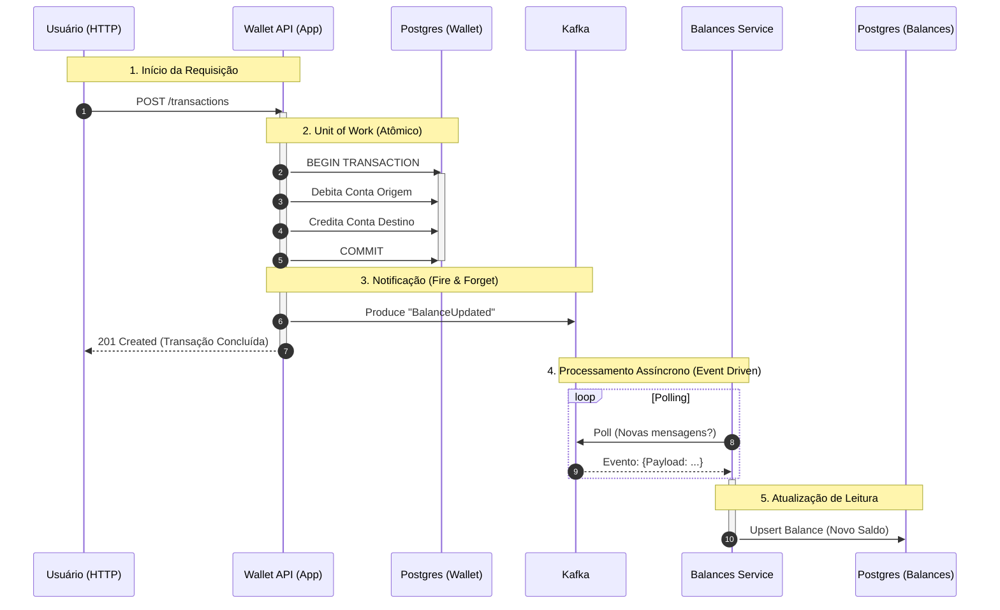
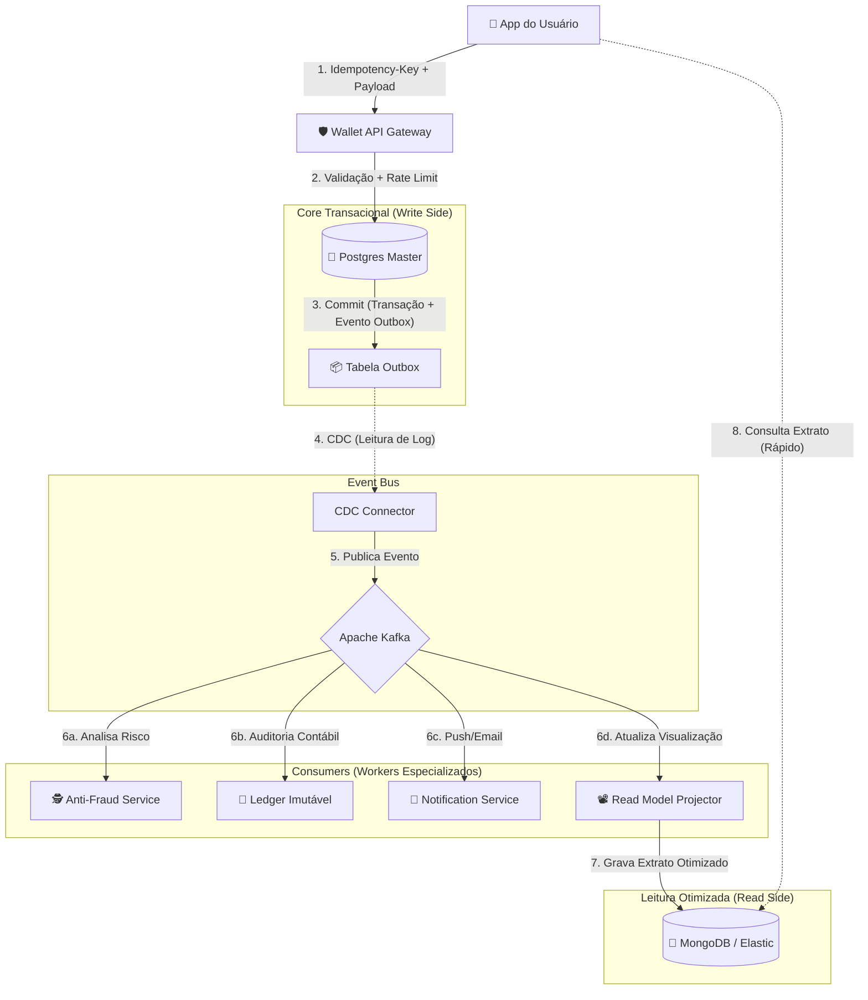

# Wallet Core (EDA Study)

Eu desenvolvi este projeto como uma implementação de um núcleo de transações financeiras (Wallet Core) baseada em Arquitetura Orientada a Eventos (EDA).

Ele nasceu como parte do desafio do curso Full Cycle, mas eu decidi utilizar uma stack moderna e funcional com **Clojure** e **Polylith**, focando em imutabilidade, modularidade e separation of concerns.

## 🏗 Arquitetura & Stack

Eu estruturei o projeto como um Monorepo modular gerenciado pelo **Polylith**:

* **Linguagem:** Clojure (JDK 17+)
* **Gerenciamento de Workspace:** Polylith (`poly`)
* **Validação de Dados:** Malli
* **Banco de Dados:** PostgreSQL 15 (via `next.jdbc` e `HoneySQL`)
* **Mensageria:** Apache Kafka (via `Jackdaw`)
* **API:** Jetty + Reitit + Ring

### Estrutura do Workspace


```text
bases/
  └── wallet-api/       # API Gateway (REST -> Componentes)
  └── balances-api/     # API Balance (REST + Kafka Consumer) [NOVO]
  └── event-processor/  # Worker (Processamento Assíncrono)
components/
  ├── account/          # Domínio de Contas e Saldo
  ├── balance/          # Domínio de Leitura de Saldos (CQRS Projection) [NOVO]
  ├── client/           # Domínio de Clientes
  ├── transaction/      # Core: Atomicidade e Orquestração
  ├── database/         # Infra: Connection Pool e Migrations
  └── kafka/            # Infra: Producers
projects/
  └── wallet/           # Artefato Deployável (Wallet Core)
  └── balances/         # Artefato Deployável (Balances Service) [NOVO]
```

## ✅ Conformidade e Integridade do Sistema

Este projeto foi desenvolvido não apenas como uma resposta aos diffs do desafio, mas como um sistema completo e resiliente que garante a integridade dos dados através de uma arquitetura orientada a eventos.

### Requisitos Atendidos

| Requisito | Implementação e Garantia de Integridade |
| :--- | :--- |
| **Microsserviço Independente** | O serviço de `Balances` é um projeto Polylith isolado, com seu próprio ciclo de vida, banco de dados e porta (**3003**), garantindo o desacoplamento físico e lógico. |
| **Consistência Eventual** | A integridade entre o `Wallet Core` e o `Balances` é mantida via Kafka. O fluxo garante que qualquer alteração de saldo no Core seja propagada de forma assíncrona e confiável. |
| **Persistência de Balances** | Diferente de uma simples cache, o Balances possui seu próprio banco PostgreSQL (`balances-db`), permitindo consultas históricas e recuperação de estado independentemente da Wallet. |
| **Automação Total (Seed & Migrations)** | O sistema é "zero touch". Ao subir o Docker, as migrations do Wallet e do Balances rodam em paralelo, e o Wallet popula dados iniciais (Seed) que fluem automaticamente até o Balances via eventos. |
| **Contrato de Dados** | A estrutura de mensagens no Kafka segue um padrão estrito, garantindo que o consumidor de Balances processe apenas informações válidas para atualização de saldo. |
| **Documentação Viva** | O arquivo `requests.http` foi estendido para incluir testes de ponta a ponta que validam a integridade do fluxo desde a transação até a consulta no novo microsserviço. |

### Fluxo de Integridade de Ponta a Ponta
1. **Wallet Core** executa uma transação ACID no Postgres.
2. Um evento `BalanceUpdated` é emitido com o **estado final** do saldo.
3. O **Balances Service** consome o evento e realiza um `upsert` atômico no seu banco.
4. O usuário consulta `GET /balances/{id}` e recebe o dado projetado e persistido especificamente para leitura.

---


## 🚀 Como Rodar

### Pré-requisitos

* Docker & Docker Compose
* Clojure CLI
* Ferramenta `poly` (opcional, mas recomendada)

### 1. Subir Toda a Aplicação (Docker)

Para rodar todos os microsserviços (Wallet Core + Balances + Infra) de uma vez:

```bash
docker compose up -d
```

**O que acontece automaticamente:**
1. Os containers sobem (Postgres, Kafka, Zookeeper, Wallet, Balances).
2. O **Wallet Core** detecta que o banco está vazio e roda o **Seed Automático**.
   - Cria Clientes e Contas.
   - Faz transações que geram eventos.
3. O **Balances Service** recebe os eventos e atualiza seu próprio banco.

### 2. Rodar Localmente (Modo Desenvolvimento)

Se você quiser rodar um dos serviços via terminal (REPL):

**Wallet Core:**
```bash
cd projects/wallet
clojure -M -m br.com.eda.wallet-api.core
```

**Balances Service:**
```bash
cd projects/balances
clojure -M -m br.com.eda.balances-api.core
```

A API do **Wallet** estará disponível em: `http://localhost:8080`
A API do **Balances** estará disponível em: `http://localhost:3003`

## 🧪 Testando a API

Para facilitar os testes, eu preparei o arquivo `requests.http` (requer extensão **REST Client**), mas você também pode utilizar os comandos `curl` abaixo.

### 1. Health Check
Verifica se a API está online.
```bash
curl -X GET http://localhost:8080/health
```

### 2. Clientes
#### Criar Cliente
```bash
curl -X POST http://localhost:8080/clients \
  -H "Content-Type: application/json" \
  -d '{"name": "Neo", "email": "neo@matrix.com"}'
```

#### Listar Clientes
```bash
curl -X GET http://localhost:8080/clients
```

### 3. Contas
#### Criar Conta
Use o `id` retornado na criação do cliente.
```bash
curl -X POST http://localhost:8080/accounts \
  -H "Content-Type: application/json" \
  -d '{"client_id": "UUID_DO_CLIENTE"}'
```

#### Listar Contas
```bash
curl -X GET http://localhost:8080/accounts
```

#### Ver Saldo
```bash
curl -X GET http://localhost:8080/accounts/UUID_DA_CONTA/balance
```

### 4. Transações
#### Realizar Transferência
Isso debita da origem, credita no destino (Atomicamente) e publica no Kafka.
```bash
curl -X POST http://localhost:8080/transactions \
  -H "Content-Type: application/json" \
  -d '{
    "account_id_from": "UUID_CONTA_ORIGEM",
    "account_id_to": "UUID_CONTA_DESTINO",
    "amount": 100
  }'
```

#### Ver Extrato (Histórico)
```bash
curl -X GET http://localhost:8080/accounts/UUID_DA_CONTA/transactions
```

### 5. Balances Service (Microsserviço Novo)
#### Consultar Saldo
Este endpoint consulta o banco de dados exclusivo do serviço de Balances.
```bash
curl -X GET http://localhost:3003/balances/UUID_DA_CONTA
# Exemplo de resposta: {"account_id":"...","balance":100,"updated_at":"..."}
```

## 🛠 Desenvolvimento

Para rodar os testes de todos os componentes:

```bash
clojure -M:poly test

```

Para verificar a integridade do workspace:

```bash
clojure -M:poly check

```

---

## ⚠️ Trade-offs e Melhorias que Eu Planejo

### Consistência de Dados (The Dual Write Problem)
Na minha implementação atual do componente `Transaction`, eu utilizei uma abordagem pragmática para o escopo deste exercício:
1. Commit da transação no PostgreSQL (Atomicidade garantida via `jdbc/with-transaction`).
2. Publicação do evento no Kafka (Fire and forget).

**Cenário de Risco:**
Existe uma janela de falha teórica (milissegundos) entre o commit do banco e a publicação no Kafka. Se o processo da aplicação for encerrado abruptamente (Crash/OOM/Falha de Rede) exatamente neste intervalo, o sistema entrará em estado inconsistente (Dinheiro debitado, mas evento não emitido).

**Solução para Produção:**
Para evoluir este projeto para um ambiente crítico, a solução recomendada seria implementar o **Transactional Outbox Pattern**:
1. Persistir o evento em uma tabela `outbox` dentro da mesma transação SQL da transferência.
2. Utilizar um processo assíncrono (Relay ou CDC com Debezium) para ler a tabela `outbox` e publicar no Kafka com garantia de entrega *At-Least-Once*.

### Outras Melhorias
* **Idempotência no Consumo:** Garantir que os consumidores Kafka lidem com mensagens duplicadas.
* **Schema Registry:** Adotar Avro ou JSON Schema para contrato estrito de mensagens.
* **Distributed Tracing:** Implementar OpenTelemetry para rastrear o fluxo entre API -> DB -> Kafka.

---

### 📊 O Fluxo de Sequência (Passo a Passo)

Neste diagrama, eu mostro exatamente o que acontece desde o momento em que o usuário chama a API até o Worker processar o evento.



---

### 📝 Detalhando as Etapas

Aqui eu explico o que acontece em cada fase numerada no diagrama:

#### 1. A Solicitação (Síncrono)

O cliente (pode ser um App Mobile, Frontend ou Postman) envia o JSON pedindo a transferência.

* **Responsável:** `bases/wallet-api` (Handlers).
* **Validação:** O `Malli` verifica se os IDs são strings e se o valor é positivo.

#### 2. O Coração do Sistema (ACID)

É aqui que a mágica acontece. Eu usei `jdbc/with-transaction` para garantir a integridade financeira.

* **Onde:** `components/transaction`.
* **Ação:** O dinheiro sai de A e vai para B matematicamente.
* **Garantia:** Se a luz acabar na linha do "Débito", o "Crédito" nunca acontece e o banco faz *Rollback* automático. **O dinheiro está seguro.**

#### 3. A Promessa (Eventual Consistency)

Imediatamente após o banco confirmar "OK, gravei", a API avisa o Kafka.

#### 4. O Microsserviço de Balances (Consumidor)

Em um container separado, o **Balances Service** acorda ao receber o evento.

* **Onde:** `bases/balances-api` (Consumer).
* **Ação:** Ele deserializa o evento `BalanceUpdated`.
* **Efeito:** Ele atualiza a tabela `balances` no banco dedicado. Isso permite que o saldo seja consultado rapidamente sem sobrecarregar o banco principal de transações.

### Por que eu escolhi separar assim?

Se o passo **4** falhar (ex: serviço de Balances fora do ar), a transação **não é cancelada**. O dinheiro já foi movido no passo **2**. O Consumers apenas reprocessa o evento quando o serviço voltar. Isso garante **Alta Disponibilidade** para a Wallet.


---

Para transformar meu projeto acadêmico `eda-study` em uma arquitetura de **Fintech Real ("Battle-Tested")**, eu precisaria endereçar problemas que só aparecem em escala e com dinheiro de verdade em jogo: **Fraude, Consistência Eventual, Latência e Escalabilidade de Leitura.**

Abaixo, eu ilustro como esse sistema evoluiria na vida real.

### 🏛 A Arquitetura Fintech Realista (CQRS + Event Sourcing + Sagas)

Neste cenário, o fluxo não é apenas "Mover dinheiro e Logar". O evento `TransactionCreated` dispara uma reação em cadeia em vários departamentos (Microsserviços).

#### 1. O Diagrama de Fluxo "Battle-Tested"



---

### 🧠 Deep Dive: Minhas Reflexões sobre Engenharia e Arquitetura

Vou detalhar as camadas que eu adicionaria e por que elas são obrigatórias numa Fintech real.

#### 1. A Entrada: Idempotência e Rate Limiting

No meu código atual, se o usuário clicar 2 vezes no botão "Transferir", o dinheiro sai 2 vezes.

* **Realidade:** O App envia um Header `Idempotency-Key` (um UUID gerado no celular).
* **Engenharia:** A API verifica no Redis se essa chave já foi processada. Se sim, retorna o resultado anterior cacheado, sem tocar no Postgres. Isso evita **Double Spending** em redes instáveis.

#### 2. O Core: Transactional Outbox (CDC)

Como eu mencionei antes, o código atual tem o risco de escrever no banco e falhar no Kafka.

* **Realidade:** Usamos **CDC (Change Data Capture)**. Ferramentas como **Debezium** leem o log binário do Postgres (WAL) e garantem que *cada linha inserida no banco vire um evento no Kafka*.
* **Benefício:** Zero perda de dados. O banco é a fonte da verdade, o Kafka é o reflexo fiel.

#### 3. O Cérebro: Fraude e Sagas (Compensating Transactions)

E se a transferência for aprovada pelo banco, mas o Worker de Fraude (`Fraud`) detectar que é uma lavagem de dinheiro 1 segundo depois? O dinheiro já saiu!

* **Arquitetura:** Padrão **Saga (Coreografia)**.
* **Fluxo:**
1. Core: Move dinheiro (Status: `PENDING`).
2. Kafka: Publica `TransactionPending`.
3. Fraud Worker: Analisa. Se detectar fraude, publica evento `FraudDetected`.
4. Core (Consumer): Escuta `FraudDetected` e executa uma **Transação de Compensação** (Estorno/Refund) e marca como `REJECTED`.


#### 4. A Visão: CQRS (Command Query Responsibility Segregation)

No meu código atual, eu uso `h/select` na mesma tabela `transactions` que recebe escritas.

* **O Problema:** Num dia de pagamento (dia 5), milhões de pessoas abrem o app para ver o saldo (Leitura), travando o banco para quem quer transferir (Escrita).
* **Realidade:** Separamos leitura e escrita.
* **Write Side (Postgres):** Normalizado, rígido, focado em integridade.
* **Read Side (NoSQL/Elastic):** O Worker `Projector` pega o evento e monta um JSON pronto para a tela do celular ("Extrato Bonito").


* **Engenharia:** O App consulta o NoSQL. É absurdamente rápido e barato, e nunca trava as transações.

#### 5. O Livro Razão: Ledger Imutável

A tabela `transactions` do meu projeto é mutável. Numa fintech, contadores precisam de um histórico que prova que o saldo de A + B é igual ao total de dinheiro no banco.

* **Realidade:** O Worker `Ledger` grava num banco específico (como **Datomic** ou **XTDB** em Clojure) que suporta auditoria temporal e imutabilidade criptográfica.

---

### 🧪 Por que eu escolhi o Clojure?

A stack que eu escolhi (**Clojure + Kafka**) é a "Arma Secreta" do Nubank e outras gigantes. Vou explicar por quê:

1. **Imutabilidade por Padrão:** Em sistemas concorrentes (milhares de transações/segundo), não ter que lidar com objetos mudando de estado na memória evita uma classe inteira de bugs.
2. **EDN (Extensible Data Notation):** O Clojure trafega dados como mapas. Diferente do Java (que precisa converter JSON -> Objeto -> DTO -> DAO), o Clojure processa o dado "nu e cru" dos Workers de forma extremamente performática.
3. **Datomic/XTDB:** Bancos de dados feitos em Clojure que resolvem o problema de auditoria nativamente.

**Resumo da Evolução do meu projeto:**
Meu projeto atual é o **"MVP Funcional"**.
A versão Fintech Real adiciona: **Idempotência (Segurança)**, **CDC (Consistência)**, **Sagas (Reversão)** e **CQRS (Escalabilidade)**.